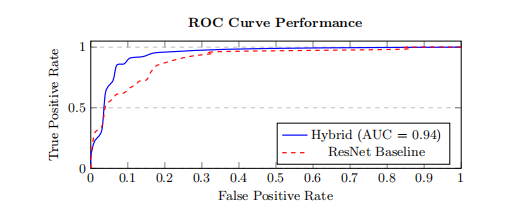
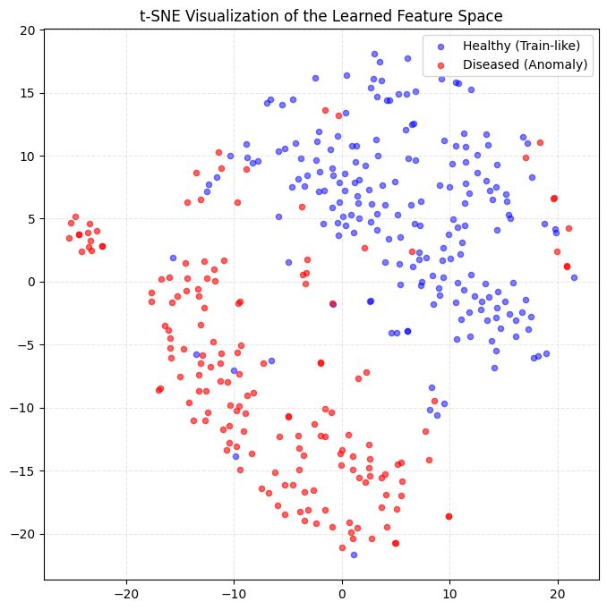

# HAD-Net: Unsupervised Retinal Anomaly Detection using Hybrid Texture-Semantic Features

This repository contains the official implementation of **HAD-Net** (Hybrid Anomaly Detection Network), a novel unsupervised framework designed for the identification of pathologies in retinal fundus images.

## 🌟 Research Highlights
- **Unsupervised Learning:** The model is trained exclusively on "healthy" samples to learn a robust representation of normality, eliminating the need for expensive pathological annotations.
- **Hybrid Feature Fusion:** Fuses high-level semantic features (ResNet18) with interpretable low-level texture biomarkers (Haralick and Local Binary Patterns).
- **Superior Performance:** Achieved an **AUROC of 0.9435** on the APTOS 2019 dataset, outperforming the deep-only baseline by **+4.41%**.
  
## 📊 Dataset: APTOS 2019
We evaluated our framework on the **APTOS 2019 Blindness Detection** dataset (provided by the Asia Pacific Tele-Ophthalmology Society).

- **Training Set:** 1,434 pure healthy images (Class 0).
- **Test Set:** 366 mixed images (Healthy Class 0 vs. Anomalous Classes 1-4).
- **Goal:** Unsupervised detection of Diabetic Retinopathy (DR) using only a definition of "normality" learned during training.

## 🔬 Methodology: Why Hybrid?
Standard Deep Learning models (like ResNet) often prioritize macroscopic structures while potentially overlooking subtle micro-textural variations (e.g., tiny hemorrhages or faint exudates). 

HAD-Net bridges this gap by integrating:
1. **Semantic Stream:** A pre-trained ResNet18 backbone for global geometry.
2. **Texture Stream:** A specialized branch extracting 16 handcrafted texture biomarkers (GLCM & LBP).
3. **One-Class Center Loss:** A contrastive-style objective that maps healthy samples into a compact hypersphere in a shared 128-D latent space.

## 📊 Ablation Study & Results
We conducted a rigorous comparison between our proposed hybrid model and a standard "Deep-Only" (ResNet18) baseline.

| Method | Texture Features | AUROC | Improvement |
| :--- | :---: | :---: | :---: |
| ResNet18 (Baseline) | ❌ | 0.9036 | - |
| **HAD-Net (Ours)** | ✅ | **0.9435** | **+4.41%** |

### ROC Curve Comparison
The bleu curve (Hybrid) demonstrates higher sensitivity at low false-positive rates compared to the baseline (red).


### Latent Space Visualization (t-SNE)
Healthy samples form a tight cluster, while diseased samples are effectively pushed away.


## 📂 Project Structure
The code is modularized for reproducibility:
- `preprocessing/`: Ben Graham's method and CLAHE filters.
- `features/`: Extraction of GLCM (Haralick) and LBP biomarkers.
- `models/`: Implementations of `HADNet` and `DeepOnlyAnomalyNet`.
- `data/`: Custom PyTorch dataset for multi-modal feature loading.
- `utils/`: Hypersphere center initialization and training logic.
- `notebooks/`: Comparison notebooks and visualization scripts.

## 🛠️ Installation
```bash
git clone https://github.com/mohammed-kaddour/Retinal-Anomaly-Detection-HADNet.git
pip install -r requirements.txt
